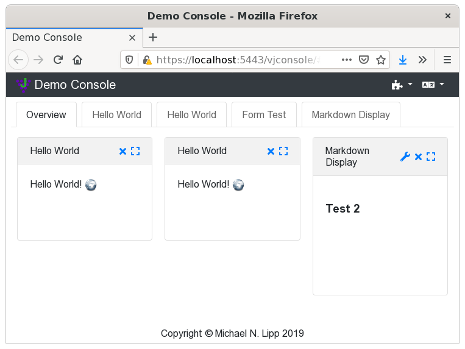

JGrapes-WebConsole
==================

| Package | Bintray |
| ------- | ------- |
| base    | 
| jqueryui | 
| bootstrap4 | 

See the [project's home page](https://mnlipp.github.io/jgrapes/).

This repository holds the sources for jars that provide
the web console components of the JGrapes framework.

Overview
--------

A web console built with the components provided here is a single
page application (SPA) that &mdash;from the user's point of view&mdash;
consists of a fixed frame with configurable content. The frame provides
some means to add content (typically by using a dropdown menu) and to 
configure global settings such as the locale.

The content of the frame is provided by web console display components 
or "conlets" for short. These components typically provide a summary
or preview display that can be put on an overview panel in a dashboard
style and a large view that is supposed to fill the complete frame.

Tabs or a menu in a side bar can be used to switch between
the overview panel(s) and the large views of the different conlets. 

Demo
----

A [demo configuration](https://jgrapes-portal-demo.herokuapp.com/)
of the portal is available at [heroku](https://www.heroku.com/).

Building
--------

The libraries can be built with `gradle build`. For working with 
the project in Eclipse run `gradle eclipse` before importing the 
project. 

If you want to use 
[buildship](https://projects.eclipse.org/projects/tools.buildship),
import the project as "Gradle / Existing Gradle Project". Should you
encounter the (in)famous 
["sync problem"](https://github.com/eclipse/buildship/issues/478),
simply restart Eclipse.
